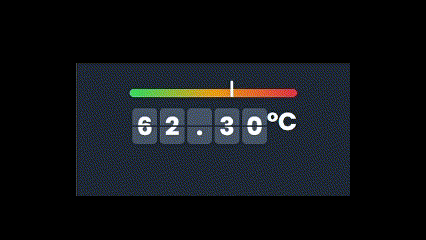

# Raspberry PI temperature monitor

a simple fastapi app to monitor the temperature of your raspberry pi through a web interface



## Installation

1. Clone the repository
2. Install the requirements (pipenv install)
3. Run the app `uvicorn server:app --port 80 --host 0.0.0.0`

## Server Development

```
pipenv run uvicorn server:app --port 8000 --host 0.0.0.0 --reload
```
